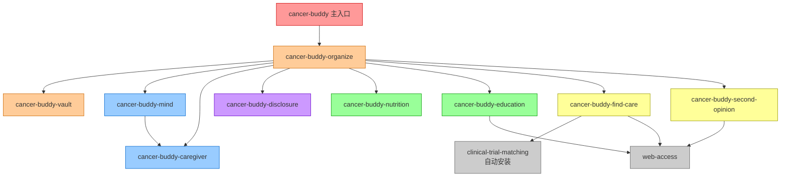

# 🎗️ Cancer Buddy Skill Suite — 完整功能指南与新功能展望

> **版本**：2.5.x · **更新日期**：2026-05-25
>
> 本文档汇总所有 cancer-buddy 子技能的功能说明，并在每个技能末尾附上基于现有能力推演的**新功能方向**，供产品迭代参考。

---

## 目录

| # | 技能 | 一句话定位 |
|---|------|----------|
| 1 | [cancer-buddy（主入口）](#1-cancer-buddy主入口) | AI 抗癌伙伴，分诊路由 + 危机守门 |
| 2 | [cancer-buddy-organize](#2-cancer-buddy-organize) | 病历 OCR → 结构化档案 |
| 3 | [cancer-buddy-vault](#3-cancer-buddy-vault) | 患者 N=1 数据保险箱 |
| 4 | [cancer-buddy-mind](#4-cancer-buddy-mind) | 心理筛查与危机支援 |
| 5 | [cancer-buddy-caregiver](#5-cancer-buddy-caregiver) | 照护者专属支持 |
| 6 | [cancer-buddy-disclosure](#6-cancer-buddy-disclosure) | 告知协商（告不告诉） |
| 7 | [cancer-buddy-nutrition](#7-cancer-buddy-nutrition) | 分阶段个性化营养方案 |
| 8 | [cancer-buddy-education](#8-cancer-buddy-education) | 患者宣教手册生成 |
| 9 | [cancer-buddy-find-care](#9-cancer-buddy-find-care) | 找医院 / 找医生 / 找试验中心 |
| 10 | [cancer-buddy-second-opinion](#10-cancer-buddy-second-opinion) | 第二意见 Packet 打包 |
| 11 | [web-access](#11-web-access) | 所有联网操作的底层 Skill |

---

## 架构全景

```
cancer-buddy（主入口·分诊·危机守门）
│
├── 数据层
│   ├── cancer-buddy-organize   ← 病历 OCR + 结构化
│   └── cancer-buddy-vault      ← 数据保险箱 + 分级分享
│
├── 心理支持层
│   ├── cancer-buddy-mind       ← 筛查 + 危机处理
│   └── cancer-buddy-caregiver  ← 照护者专属
│
├── 沟通与披露层
│   └── cancer-buddy-disclosure ← 告知协商
│
├── 信息获取层
│   ├── cancer-buddy-nutrition  ← 饮食方案
│   ├── cancer-buddy-education  ← 宣教手册
│   ├── cancer-buddy-find-care  ← 资源发现
│   └── cancer-buddy-second-opinion ← 第二意见
│
└── 网络基础设施
    └── web-access              ← 联网底层
```

---

## 1. cancer-buddy（主入口）

### 功能定位

**AI 抗癌伙伴的总入口**。不替代医生，不做临床决策；专注陪伴、分诊路由和危机守门。

### 核心功能

#### 🚨 危机检测（最高优先级，先于一切流程）

| 类型 | 触发示例 | 处理方式 |
|------|---------|---------|
| 明示自杀意念 | "不想活了"、"想死"、"一了百了" | 5步危机响应 → 立即给热线 |
| 被动/隐性意念 | "没有我会不会更好"、"希望睡过去不要醒来" | C-SSRS 第1题阳性，同等处理 |
| 照护者危机 | "我撑不下去想跟着走" | 与患者等级相同，不降级 |

**5步固定响应流程**：
1. 立即停下所有其它流程
2. 共情确认（患者/照护者分别有专属话术）
3. 输出完整 24小时热线（400-161-9995 等，不省略、不放末尾）
4. 评估当下安全 + 追问频率/强度
5. 绝不使用"别担心""想开点"等劝慰式表达

**危机路径终止规则**：用户确认已拨热线/联系身边人/同意去急诊，**或**提供具体24小时安全计划，才可继续；"我没事了"不作为退出条件。

#### 🧭 角色识别与路由

```
用户身份: 患者 / 主照护者 / 其他家属
         ↓
自动识别(无需重复询问) → role.json
         ↓
按身份分发到对应子技能
```

路由矩阵摘要：

| 需求场景 | 患者 | 照护者 | 其他家属 |
|---------|------|--------|---------|
| 病历整理 | → organize | → organize | 让主照护者来 |
| 陪护支持 | 给家人的要点 | → **caregiver** | → caregiver 简版 |
| 心理支持 | → mind 自我筛查 | → mind 照护者版 | → mind 怎么支持Ta |
| 告知协商 | → disclosure 反向版 | → **disclosure** | → disclosure 支持版 |
| 宣教手册 | 患者自学版 | 家属操作版 | 2页亲友简报 |
| 营养饮食 | → nutrition 自己做 | → nutrition 备餐版 | 让主照护者来 |
| 找医院/试验 | → find-care | → find-care | 让主照护者来 |
| 第二意见 | → second-opinion | → second-opinion | 让主照护者来 |

#### 🔬 MTB 路由（条件性）

- 检测到 `vmtb-skill`/`cancerdao-vmtb`：自动调用，传入患者目录
- 未检测到：引导到 find-care（找能做MTB的医院）+ organize（整理成MTB格式）+ second-opinion（跨境会诊包）

#### 📋 不做的事（硬边界）

> 临床试验 criterion 级匹配、诊断路径决策、扩展准入/博鳌、缓和医疗决策、副作用 CTCAE 分级 triage、服药漏服临床决策、生存期晚发效应监测、换线决策

一律回：**"这部分要问你的主诊医生。你可以用搭子帮你整理问问题的清单。"**

#### 🔄 身份切换

`/switch-role <patient|caregiver|family>` — 随时切换，更新 role.json

---

### 💡 新功能方向

#### A. 智能"问诊清单"生成器
当用户触碰"不做的事"边界时，不仅转诊，还自动生成一份**结构化的"问医生清单"**（按临床问题分类，可选择直接打印或发给照护者）。

#### B. 多轮会话记忆摘要卡
每次会话结束时，除了现有的"今天聊到的"小结，额外生成一张**时间线摘要卡**（患者+日期+本次进展+下次要做的事），写入 `vault`，可在下次会话时调出"上次我们聊到了……"。

#### C. 照护者/患者"交接日志"
当会话在患者↔照护者间切换（`/switch-role`），自动生成一份**交接摘要**给新角色，说明"上一位用这个账号的人最近做了/担心了什么"，减少信息断层。

---

## 2. cancer-buddy-organize

### 功能定位

将杂乱的原始病历文件（PDF/JPG/PNG/DOCX/ZIP）转换成所有下游子技能可直接使用的**结构化患者档案**。

### 核心功能

#### 📂 输入格式支持
- 单文件：PDF、DOCX、JPG、PNG
- 压缩包：ZIP、RAR、7Z、TAR.GZ
- 文件夹路径

#### 🗂️ 输出结构

```
patients/<patient_code>/
├── INDEX.md             # 目录首行含 patient_code
├── profile.json         # 符合 patient-profile-schema 的结构化数据
├── timeline.md          # 人类可读的治疗时间线
├── readiness.json       # MTB就绪度 + review_flags[]
├── review_flags.md      # 可疑值审计（有异常才生成）
├── review_summary.md    # 始终生成的人工速查清单（5项关键字段+原文引用）
├── case_text.md         # 综合叙述文本
├── 01_当前状态/ … 11_诊断证明/   # 11个语义分桶
├── 10_原始文件/         # 每个源文件的审计镜像（字节完全一致）
└── ocr/                 # OCR侧文件（含 SOURCE/CONFIDENCE 标头）
```

#### ⚡ 并行 Fan-Out 工作流

```
Step 1  解析输入，确认路径
Step 2  规划切片（单次 vs 扇出）
        ├── ≤15 文件    → 单次模式（1个Phase-1 Worker）
        ├── ≥2子目录    → 每子目录一个Worker（超过15文件则分半）
        └── 无子目录>15 → 按15文件切 batch_a/b/c…
Step 3  并行 Phase-1 OCR Workers（每个只写 ocr/ 和 10_原始文件/）
Step 4  Phase-1 续传循环（超时/超预算的Worker分批续跑）
Step 5  Phase-2 综合Worker（唯一一个读全量sidecar做跨切片分析）
        ├── 11桶语义分类
        ├── 语义重命名（非硬编码词库）
        ├── 若识别出癌种，重命名 patient_dir 为 <癌种>_<年月>_<hash4>
        ├── 生成 profile.json / timeline.md / readiness.json
        └── 5项 review_flags 审计
Step 6  覆盖率缺口重试（直到 coverage_complete=true）
Step 7  验证输出完整性
Step 8  就绪度评级（A-F）
Step 9  ★ 强制展示 review_summary.md（最先展示给用户的内容）
Step 10 ★ 强制展示 review_flags（红旗必须人工确认才放行下游）
Step 11 展示 Profile Card（中英 + 通俗解释格式）
```

#### 🔴 下游阻断规则

**只要有未确认的🔴红色 review_flag，任何下游技能均不得启动**，防止错误数据毒化试验匹配/MTB/营养等报告。

#### 🔒 安全约定

- 无法读取的字段写 `null`（JSON）或 `[OCR_UNCERTAIN]`（文本），不猜不编
- `10_原始文件/` 是永久审计轨迹，保存每个源文件的字节级镜像

---

### 💡 新功能方向

#### A. 增量更新模式
当患者再次带来新报告时，支持**增量 organize**：只 OCR 新增文件，合并到已有 `profile.json`/`timeline.md`，并标记哪些字段因新报告而更新（"肿瘤标记物 CEA 由 45.2 更新为 12.1"）。

#### B. 医院格式预设库
内置主要三甲医院的报告格式先验知识（如北京肿瘤/复旦肿瘤/中山肿瘤常见报告模板），在 OCR 前先匹配模板，大幅提升字段识别准确率，减少 review_flags。

#### C. 时间线可视化导出
将 `timeline.md` 导出为交互式 Mermaid Gantt 图或 HTML 时间轴，让患者/照护者直观看到完整治疗历程，也方便交给第二意见医生。

#### D. 多患者家庭视图
家庭中同时有多位患者（如夫妻同患）时，提供**家庭视图**，在一个界面下管理多个 `patient_code`，便于照护者统一追踪。

---

## 3. cancer-buddy-vault

### 功能定位

患者**本地自主数据保险箱**——不是云存储，而是一套有分级权限控制、可选择性共享、完整审计日志的本地文件结构。患者完全拥有数据，可随时移动或选择性共享。

### 核心功能

#### 🔐 四级分享权限

| 图标 | 级别 | 描述 |
|------|------|------|
| 🔒 | **Private** | 仅患者+直系家属可见 |
| 🔑 | **Authorized** | 指定临床医生（邮件/联系人），签名URL+有效期 |
| 📊 | **Anonymized-for-AI** | 去除PII、哈希patient_id，可用于研究 |
| 🌐 | **Public** | 完全去标识化案例报告（需患者明确同意） |

每次级别变更均记入 `access.log`（仅追加，不可改写）。

#### 📦 输出文件

```
patients/<pid>/
├── sharing-settings.json   # 每目录/文件的分享级别设置
├── access.log              # 访问/分享/导出事件（只追加）
├── vault-manifest.md       # 人类可读目录索引
└── exports/                # 加密导出包（密码带外传输）
```

#### 🔄 工作流

1. 遍历 `patients/<pid>/`，按敏感度分类每项文件
2. 初始化 `sharing-settings.json`（全部默认🔒Private）
3. 生成 `vault-manifest.md`（患者可读的目录表）
4. 去标识化处理：去除姓名/生日/住院号/机构，日期转换为"确诊后第X天"
5. 每次分享操作触发确认提示 → 记录到 access.log

#### 👥 角色行为

| 角色 | 权限 |
|------|------|
| 患者（所有者） | 读+写+删除+任意级别设置+导出 |
| 照护者（授权视图） | 读+写+导出（修改分享级别需患者历史授权记录） |
| 其他家属 | 仅📊匿名视图（诊断字段脱敏，无自由文本备注） |

---

### 💡 新功能方向

#### A. 时间胶囊功能
患者可以录制/书写一段**"给未来的自己"**的文字或语音，设定在特定时间节点（如术后3个月、1年）才可读取，作为心理支持工具。

#### B. 研究数据捐献面板
对于同意📊级别的患者，提供一个**明确的研究捐献面板**，显示"你的数据已帮助了X项研究"，增加患者参与感，并可随时撤回同意。

#### C. 跨设备加密同步
支持通过端对端加密协议（如 Signal Protocol）将保险箱同步到患者的第二台设备或家属设备，无需依赖第三方云存储。

#### D. 就诊前自动打包
在就诊日前一天，自动打包并生成"今日就诊资料包"——最新检查结果、当前用药、待问医生的问题列表，可直接发给接诊医生。

---

## 4. cancer-buddy-mind

### 功能定位

使用经过验证的量表对**患者和照护者**进行心理筛查，提供分级响应（自助/寻求专业帮助/危机升级），并内置不可绕过的危机处理规则。

### 核心功能

#### 📋 使用的量表

| 量表 | 评估维度 | 题目数 | 最低分辨率 |
|------|---------|--------|----------|
| **C-SSRS Lite** | 自杀风险 | 6题 | 始终第一个跑 |
| **PHQ-9** | 抑郁 | 9题 | 0-27分 |
| **GAD-7** | 焦虑 | 7题 | 0-21分 |
| **NCCN Distress Thermometer** | 综合痛苦度 | 0-10数字量表 + 问题清单 | — |

**运行顺序**：C-SSRS Lite → 阳性则立即危机处理；阴性则按主诉选 PHQ-9 或 GAD-7。

#### 🚨 危机规则（不可绕过）

任何时刻出现自杀意念、计划、获取手段的表达，**立即**：
1. 停止当前工作流
2. `我听到你说的了。这个念头出现本身就是一个信号——你现在需要专业的人立刻帮你。`
3. 展示 `crisis-resources.md` **完整内容**（不摘要）
4. `你现在身边有家人或朋友吗？能先让 Ta 知道你现在的状态吗？`
5. **不探究原因**、**不给安慰**、**不允许"继续"绕过危机路径**

此规则对患者/照护者/家属均适用，不因角色降级。

#### 📊 三级响应

| 严重程度 | PHQ-9 | GAD-7 | 响应 |
|---------|-------|-------|------|
| 自助 | 0-9 | 0-7 | 日志模板 + 5分钟正念练习 + 睡眠卫生单页 + 2周后复查 |
| 寻求专业帮助 | 10-19 | 8-14 | 明确建议就诊心理医生 + 列当地资源 |
| 危机 | ≥20 或 C-SSRS阳性 或 PHQ-9第9题≥1 | ≥15 | 触发危机规则 |

#### 👥 角色行为

- **患者**：直接自我筛查
- **照护者**：Zarit量表（来自 caregiver 技能）+ PHQ-9 照护者改版（同样9题，重新表述针对照护负担）；警惕最小化倾向
- **其他家属**：不做筛查，提供"如何支持抑郁家属"信息

#### 📁 输出

```
patients/<patient_code>/reports/mind/
├── phq9-YYYY-MM-DD.md
├── gad7-YYYY-MM-DD.md
├── distress-YYYY-MM-DD.md
└── crisis-YYYY-MM-DD.md   （危机触发时必须存在）
```

---

### 💡 新功能方向

#### A. 纵向情绪曲线
将多次 PHQ-9/GAD-7 分数绘制成**时间轴折线图**，叠加治疗里程碑（化疗开始、手术日、进展通知日），让患者和医生直观看到情绪与治疗的关联。

#### B. 夜间守护模式
检测到用户在深夜（22:00–05:00）发起对话且含有痛苦关键词时，自动切换到**更温柔的"陪伴模式"**：降低量表密度，优先共情，等天亮后再做正式筛查。

#### C. 照护者匿名互助圈（可选）
由照护者自愿加入的匿名文字小组（基于去标识化的shared-context），搭子作为主持人引导同伴互助，每次讨论结束后提供结构化支持摘要。

#### D. 心理医生转介包
当触发"寻求专业帮助"级别时，自动生成一份**转介包**（包含PHQ-9/GAD-7原始分数、关键表述、希望重点关注的问题），打印后可直接交给心理医生，减少重复陈述。

---

## 5. cancer-buddy-caregiver

### 功能定位

为**主照护者（配偶/父母/成年子女）** 提供专业级支持——化疗陪诊清单、家庭分工模板、Zarit负担量表、如何向孩子解释、悲伤预期准备。以照护者自身为中心，不是附属服务。

### 核心功能

#### 📋 六大工作流

| 场景 | 内容 |
|------|------|
| **首次进入** | Zarit负担基线筛查 + 填写照护者信息到 profile.json.caregivers[] |
| **化疗/放疗/手术日前** | chemo-companion-checklist（当天带什么/要问什么/注意什么）|
| **想分担家庭负荷** | family-roles-template（谁跑医院/谁取药/谁做情绪支持/谁管财务）→ 可导出共享家庭文档 |
| **孩子问怎么了** | 分年龄段话术（explaining-cancer-to-children：幼儿/小学/青少年）|
| **"我撑不下去了"** | Zarit > 21 或 自杀表达 → 路由到 cancer-buddy-mind 照护者危机分支 |
| **为坏消息做准备** | 柔性预期框架："你想不想花10分钟想一下，如果复查结果不好，你希望Ta得到什么？" |

#### 👥 角色行为

| 角色 | 处理方式 |
|------|---------|
| 照护者 | 全量工作流；30%权重在照护者自身照顾提示 |
| 其他家属 | 简化版：重点"如何支持主照护者而不增加负担"；跳过Zarit深度挖掘和化疗陪诊单 |
| 患者 | 拒绝 → 提供2页要点摘要供患者展示给照护者 |

#### 📁 输出

```
patients/<patient_code>/reports/caregiver/
├── zarit-YYYY-MM-DD.md          # 纵向负担分数
├── chemo-prep-YYYY-MM-DD.md     # 每次陪诊清单
├── family-roles.md              # 可编辑的家庭分工文档
└── explaining-to-children.md   # 如有需要
```

#### 🔒 安全约定

- 绝不羞辱 burnout（"burnout是非理性情境下的理性反应"）
- 绝不说"你要为Ta坚强"
- 绝不鼓励向患者隐瞒信息

---

### 💡 新功能方向

#### A. 照护者自我照顾日历
基于照护者填写的当前治疗计划，自动规划**照护者的"喘息时间"**——在化疗间期等低密度时段标记出可以休息/放松的窗口，并提供简短的自我照顾活动建议（不必须是长时间外出）。

#### B. 家庭会议议程生成
当家庭成员分工有争议或有重要决策需要集体讨论时，生成一份**结构化家庭会议议程**（议题列表、发言建议顺序、决策框架），帮助家庭更高效地沟通。

#### C. 纵向 Zarit 曲线
与 mind 技能联动，将多次 Zarit 分数绘制成时间曲线，叠加患者治疗里程碑，帮助照护者看到自己的负担变化趋势，也为心理医生提供参考。

#### D. 紧急联系人"接力卡"
当主照护者临时无法陪诊时，生成一张**一页接力卡**（患者基本信息、当前治疗方案、关键注意事项、紧急联系方式），可在15分钟内让备用照护者顶上。

---

## 6. cancer-buddy-disclosure

### 功能定位

专为**中国家庭文化背景**设计的告知协商技能。不判断初始隐瞒的对错，帮助家庭从隐瞒→部分告知→充分告知**渐进过渡**，而非逼迫一次性告知。

### 核心功能

#### 🔄 分层披露模型（非二元）

```
suppressed（隐瞒）
    ↓ 第一层
partial（部分告知：确诊 + 基本信息）
    ↓ 第二层
+ 预后
    ↓ 第三层
+ 治疗选项
    ↓ 第四层
full（充分告知：含缓和医疗选项）
```

每层转变均记录到 `disclosure_history[]`（时间戳 + 谁决定 + 原因）。

#### 📊 工作流步骤

1. **确认当前状态**：患者目前知道多少？家庭想要什么？读取 `profile.disclosure_state` + `disclosure_history[]`
2. **评估患者决策能力**：认知正常 → 标准成人告知轨道；痴呆/谵妄 → 切换到代理决策轨道
3. **询问患者本人的知情意愿**（家属常未问过）
4. **生成适龄/适关系的脚本**：包含老人/配偶/子女/青少年患者5种配置
5. **当患者主动问"我是不是癌症？"**：不强迫全告知，提供转圜脚本；同一问题3次以上→视为知情意愿信号，开始下一层过渡
6. **需要专业调解时**：建议医务社工/伦理委员会（内部家庭分歧 + 患者有能力且想知道 → 不由搭子仲裁）

#### 👥 三种角色的不同视角

| 角色 | 情景 | 处理方式 |
|------|------|---------|
| 患者（反向案例） | 年轻患者告诉年迈父母/配偶/孩子 | 第一人称脚本；患者决定分享什么 |
| 照护者（主线） | 是否/如何/何时告诉患者 | 承认隐瞒背后的爱与恐惧，提供渐进路径 |
| 其他家属 | 是否打破主照护者的隐瞒 | 尊重主照护者的协调角色，但维护患者自主权；分歧→调解 |

#### 🔒 安全红线

1. 患者有能力且想知道 → **永不压制知情权**（家庭偏好不能压倒患者自主权）
2. **永不鼓励永久隐瞒**（临时/有节奏的隐瞒是人道的；永久隐瞒当患者明确想知道时不可接受）
3. **永不羞辱家庭的初始隐瞒选择**（这是中国家庭文化下出于爱的起点）
4. 认知障碍患者→**单独的代理决策轨道**，不适用成人自主权逻辑
5. 涉及法律/预立医嘱/家庭内部严重分歧→建议伦理委员会，不在聊天中仲裁

---

### 💡 新功能方向

#### A. 告知演练模式
提供**角色扮演演练**——搭子扮演患者，照护者练习说出那句话。结束后给出反馈（哪里说得好、哪里可能让患者感到被瞒了很久而委屈），帮助家属在真实告知前降低恐惧。

#### B. 文化背景参考库扩展
从单一"中国家庭隐瞒"扩展到**多元亚裔文化模块**（日本/韩国/东南亚）以及**跨文化配偶**（中外婚姻）场景，提供文化差异说明和调解建议。

#### C. 告知后支持跟踪
告知发生后，主动在1周、1个月后触发跟进："上次你告诉了Ta，Ta的反应怎么样？你们现在还好吗？"提供告知后家庭关系修复资源。

#### D. 患者偏好早记录
在确诊早期（趁患者尚未失能）引导患者填写**知情偏好声明**（"万一我认知受损，我希望……"), 存入 vault，作为后续代理决策的参考依据。

---

## 7. cancer-buddy-nutrition

### 功能定位

基于**当前治疗阶段和合并症**生成有循证依据的、适应中国饮食文化的个性化营养方案，并强制检查药物-食物相互作用。

### 核心功能

#### 📅 覆盖的治疗阶段

| 阶段 | 关注点 |
|------|--------|
| 术前 | 增强营养储备，控制合并症 |
| 术后恢复 | 蛋白质修复，伤口愈合，防感染 |
| 化疗活跃期 | 控制恶心/口腔炎，维持热量，避免生食 |
| 放疗活跃期 | 减少放射性黏膜炎，局部对应 |
| 免疫治疗 | irAE相关饮食注意，免疫激活期调整 |
| 靶向治疗 | TKI空腹/餐后服药时间，特定食物禁忌 |
| 维持期 | 长期均衡，恢复正常生活质量 |
| 生存期 | 防复发，体重恢复，骨密度支持 |

#### ⚠️ 关键药物-食物相互作用（必须红色标出）

| 药物 | 禁忌食物 | 风险 |
|------|---------|------|
| TKI（伊马替尼/奥希替尼等） | 西柚汁 | AUC显著升高，毒性增加 |
| 华法林 | 大量深色叶菜（菠菜/西兰花）| INR波动，出血风险 |
| 奥沙利铂 | 冷食/冷饮 | 诱发/加重神经毒性 |
| 免疫抑制期 | 生食/未经巴氏消毒食品 | 感染风险 |
| 人参 | 抗凝药 | 出血风险 |

#### 🍱 输出方案

- **7天菜单**（适配北方/南方/川湘/粤地区饮食偏好）
- **购物清单**（照护者角色时附带）
- **批量备餐计划**（照护者角色时附带）
- **补剂评估报告**（用户询问时，附循证证据等级）

#### 🔒 安全约定

- 无A级证据的"抗癌食物"说法**一律拒绝**（灵芝孢子粉/虫草/"抗癌茶"→明确标注"尚无可靠循证支持"）
- 免疫低下期：食品安全优先于宏量营养素比例
- 体重减轻10-20%的患者：目标是"吃得下、保住体重"，不是理想营养比例
- 永不建议停止循证治疗改用饮食疗法（如 Gerson 方案）

---

### 💡 新功能方向

#### A. 每日推送菜谱+采购提醒
与手机日历/微信集成，每天早上发送**今日推荐三餐**（基于当日治疗安排调整，如今日化疗→重点易消化食物），照护者收到后直接按单操作。

#### B. 医院餐分析
当患者住院时，提供**医院餐厅菜单评分**（输入当天菜单，返回"今天能吃什么、应该避开什么"），适配住院场景。

#### C. 症状驱动的实时调整
当患者通过 mind 或直接报告"今天很恶心"/"口腔溃疡厉害"/"拉肚子"时，**自动调用营养技能**生成当日调整方案（当天推荐食物/避免食物），而无需用户主动触发。

#### D. 补剂安全数据库扩展
建立覆盖中国市场常见肿瘤患者补剂的**完整循证数据库**（包含中成药、植物提取物），每条记录包含：作用机制声明、临床证据等级、与化疗/靶向药的已知相互作用、剂量安全窗口。

---

## 8. cancer-buddy-education

### 功能定位

将临床报告转化为**患者和家属真正能用的**教育手册——用温暖直白的语言，配合 Mermaid 可视化图表，分角色生成不同版本。

### 核心功能

#### 📚 手册章节结构

| 章节 | 内容 |
|------|------|
| 封面 | 患者姓名/patient_code/日期/主诊医生联系方式 |
| 快速参考卡 | 急诊指征（发热>38.5℃、新发出血、严重气促、意识改变）+ 紧急联系人 |
| 我的健康摘要 | 1页白话文病情说明 |
| 药物手册 | 每种药：作用机制/剂量/副作用观察表/何时打电话给医生 |
| 日常生活指南 | 营养占位符（v2 完整版）/运动/睡眠/工作 |
| 随访计划表 | 从monitoring calendar推导 |
| 费用与医保导航 | 药物获取途径/医保政策/患者援助项目 |
| FAQ | 按治疗阶段分组的常见问题 |
| Mermaid图表 | 疾病机制流程图/治疗决策树 |

#### 👥 三个角色版本

| 角色 | 版本特点 |
|------|---------|
| 患者 | 第一人称；含我的健康摘要/药物手册/日常生活指南 |
| 照护者 | 重构为陪诊视角（"Ta的化疗药清单+你该留意的红旗症状"）；追加 `## 你的自我照顾` 章节 |
| 其他家属 | 2页亲友简报：疾病名+白话解释/当前阶段/一句话预后/"你能帮的三件事"/"请不要做的三件事" |

#### ⚙️ 内容适配逻辑

- 仅免疫治疗 → 跳过化疗章节
- 合并T2DM → 包含糖尿病管理章节
- 机制图：按治疗类型选取（化疗/靶向/免疫/放疗）
- FAQ：按阶段选取（新确诊/积极治疗/生存期）

#### 🔒 强制安全规则

- **每个手册/快速参考卡/药物手册** 末尾必须有：`本手册为信息参考，任何治疗调整必须与主诊医生确认。`
- 急诊指征绝对化：`立即就医，不要等门诊`
- 如果 profile.json 中有未解除的🔴红色 review_flag → **阻断生成**（错误信息的手册比没有手册更危险）

---

### 💡 新功能方向

#### A. 动态版本更新
每当 organize 更新了 profile.json（新化疗方案/新药物/进展），自动提示"手册已过时，需要更新以下章节：……"，支持增量更新而非全量重写。

#### B. 多语言输出
对于有海外亲属、港澳台家庭成员或英语能力有限的患者，支持生成**英文/繁体中文双版本**，便于与海外专家沟通或港澳台就诊。

#### C. 视频讲解脚本
将手册的关键章节（如"什么是EGFR靶向治疗""化疗当天会发生什么"）转化为**视频旁白脚本**，供家庭用手机录制简短解释视频给老年患者或文字阅读困难的家属。

#### D. 个性化 ER 去向导引
在快速参考卡中，根据 `geo.current_city` 和 `profile.insurance` 自动填入**最近适合急诊的医院名称和地址**（而不只是通用的"立即就医"），让危机时刻患者/家属知道去哪里。

---

## 9. cancer-buddy-find-care

### 功能定位

**只做资源发现，不做临床判断。** 通过并行多子Agent调研，将"哪家医院能做MTB""这个癌种谁最擅长""这个靶点有没有在招试验"变成一份有评分、有挂号路径、有证据来源的结构化短名单。

### 核心功能

#### 🔍 支持的查询类型

| 类型 | 典型问题 |
|------|---------|
| **hospital** | 哪家医院能做NSCLC-EGFR的MTB？杭州/上海有哪些？ |
| **doctor** | 胰腺癌晚期国内谁做得最好？ |
| **trial_site** | HER2低表达乳腺癌有没有DXd相关试验在招？北京可以 |
| **combined** | 综合以上多类型 |

#### ⚡ 并行调研架构

```
Step 1  将用户请求翻译为结构化查询 QUERY.md
Step 2  规划并行子Agent方案（典型4-6个）
Step 3  并行派发子Agent（每个限时5分钟）
        ├── Subagent A: 国家癌症中心/复旦排行
        ├── Subagent B: 各中心官网/新闻（MTB/MDT设置情况）
        ├── Subagent C: 好大夫在线该癌种top医生
        └── Subagent D: 患者社群讨论（实际可及性）
Step 4  去重 + 评分（5维度）+ 过滤 + 排序
Step 5  写 SHORTLIST.md（top 5-8条）
```

#### 📊 评分维度

| 维度 | 含义 |
|------|------|
| 服务匹配度 | 是否真做MTB/是否专攻该癌种 |
| 地理可及性 | 是否在用户接受的城市范围内 |
| 证据强度 | 一手源>二手源；多源互证>单源 |
| 可达性 | 挂号难度/是否需要转诊/医保备案复杂度 |
| 医生类专项 | 实际出诊频率 + 患者反馈量 |

#### 🔗 临床试验匹配集成

短名单包含临床试验时，自动追加：
1. 检查 `clinical-trial-matching` skill 是否已安装
2. 未安装 → 自动拉取（`npx skills add CancerDAO/clinical-trial-matching-skill -g --all`）
3. 通过 Skill 工具调用，传入 `profile.json` + NCT/ChiCTR 编号集合
4. 输出 criterion 级入排标准逐条评估报告

#### 🔒 安全约定

- **绝不**承诺"这家医院能治好"或"这位医生方案最好"
- **绝不**鼓励通过黄牛/付费内推挂号
- **绝不**无源信息（所有内容可追溯到URL）
- 临床试验必须带"匹配不等于符合入组，以研究中心预筛为准"
- 海外推荐同步提示费用量级/签证/医疗记录跨境运输

---

### 💡 新功能方向

#### A. 实时试验状态监控
对用户关注的试验（ChiCTR/NCT编号），提供**定期状态推送**（每周检查一次招募状态），一旦试验从"计划中"变"招募中"或"招募中"变"暂停"，立即通知。

#### B. 挂号难度实时评估
接入医院官网/好大夫在线/京医通等平台，实时查询目标医生近期号源情况，在 SHORTLIST 中标注"当前号源充足/紧张/需等X周"。

#### C. 异地就医全流程包
对于跨城就医的用户，自动生成**异地就医全流程清单**：医保异地备案步骤、交通住宿推荐（医院周边患者友好住宿）、行前需准备的文件清单，一站式减少就医障碍。

#### D. 社群口碑聚合分析
在社交媒体（小红书/微博相关词条）抓取近6个月真实患者对特定医院/医生的评价，经情感分析后生成"真实患者满意度评分"，作为官方排名的补充维度。

---

## 10. cancer-buddy-second-opinion

### 功能定位

为**跨城或跨境第二意见**生成可直接提交给专业评审医生的完整资料包，以及拿到意见后如何与主诊医生沟通的脚本。

### 核心功能

#### 📦 生成的5个文件

| 文件 | 内容 |
|------|------|
| `case-summary.md` | 1-2页英文病例摘要（含ECOG/诊断分期/分子分型/治疗史/最新影像/待问问题）|
| `records-index.md` | 本次寄送资料的完整索引（日期/医院/类型/置信标签/文件名）|
| `cover-letter.md` | 医生间格式的正式信函（250-400字英文，问题前置）|
| `shipping-instructions.md` | DHL/FedEx医疗记录寄送指南（含海关申报/预计时效/数字替代方案）|
| `presentation-script.md` | 收到第二意见后如何与主诊医生沟通（共识点/分歧点/具体问题/决策框架）|

#### 🌏 覆盖的主要目标机构

| 类型 | 机构 |
|------|------|
| 国际顶级 | MSK（纪念斯隆凯特林）、MD Anderson、梅奥诊所 |
| 亚洲顶级 | 日本癌研有明医院、新加坡国立癌症中心 |
| 港澳台 | 香港养和医院 |
| 国内三甲 | 按癌种推荐相应专科最强医院 |

#### 🔒 安全约定

- **绝不**承诺具体第二意见结果（"MSK会给你新方案"）
- **绝不**鼓励将记录发送给非正规机构的付费互联网服务
- 跨境寄送：不回避海关/医疗隐私的真实复杂性
- 🔴红色 review_flag 未解除 → **阻断生成**（误导国际评审医生后果严重）

#### 👥 角色行为

| 角色 | 处理方式 |
|------|---------|
| 患者 | 第一人称 packet；若 disclosure_state=suppressed → 拒绝（属于操作员级任务）|
| 照护者 | 代表患者操作；信函可由照护者署名；附带"电话会诊时的翻译清单" |
| 其他家属 | 拒绝（需要签字/身份证明/支付，由主照护者或患者本人推进）|

---

### 💡 新功能方向

#### A. 视频会诊预约集成
接入 MSK/MDA/癌研有明等机构的**在线国际会诊预约系统**，在 packet 生成后直接引导完成预约表单填写，而不只是提供操作说明。

#### B. 第二意见对比报告
收到多个机构的第二意见后，生成**对比分析表**（治疗建议是否一致、分歧在哪里、各方证据强度），帮助患者和主诊医生做知情决策。

#### C. 实时翻译辅助
对于电话/视频会诊场景，提供**实时医学翻译提示卡**（常用肿瘤学术语的中英对照，按本次具体药物/检测项目个性化生成），供患者或照护者在翻译时参考。

#### D. 国内多院会诊协调
为需要在国内2-3家医院同时咨询的患者，提供**多院协调包**：针对不同医院生成略有侧重的病例摘要（如A院重点问靶向方案，B院重点问手术可行性），并帮助整理最终的多院意见汇总。

---

## 11. web-access

### 功能定位

**所有联网操作的底层基础 Skill**。通过智能分层的工具选择（WebSearch / WebFetch / curl / 浏览器CDP），完成从简单关键词搜索到需要登录态的复杂页面操作的全部网络任务。版本 2.5.0，MIT 许可，开源于 [github.com/eze-is/web-access](https://github.com/eze-is/web-access)。

### 核心功能

#### 🛠️ 工具选择决策矩阵

| 场景 | 工具 |
|------|------|
| 搜索摘要/关键词结果，发现信息来源 | **WebSearch** |
| URL已知，定向提取特定信息 | **WebFetch**（小模型根据prompt提取后返回处理结果）|
| URL已知，需要原始HTML（meta/JSON-LD等结构化字段）| **curl** |
| 非公开内容/静态层无效（小红书/微信公众号）| **浏览器CDP** |
| 需要登录态/交互操作/自由导航 | **浏览器CDP** |

**Jina**（可选预处理层）：`r.jina.ai/example.com` 前缀，将网页转为Markdown节省token，适合文章/博客/文档类页面，限20 RPM。

#### 🌐 浏览器 CDP 模式

通过 CDP Proxy 直连用户日常 Chrome，**天然携带登录态**，无需启动独立浏览器。

**代理 API 命令集**：

| 操作 | 命令 |
|------|------|
| 列出已打开的Tab | `curl -s http://localhost:3456/targets` |
| 创建新后台Tab | `curl -s "http://localhost:3456/new?url=URL"` |
| 执行任意 JS | `curl -s -X POST "http://localhost:3456/eval?target=ID" -d 'JS代码'` |
| 截图（含视频帧）| `curl -s "http://localhost:3456/screenshot?target=ID&file=/tmp/shot.png"` |
| 导航 | `curl -s "http://localhost:3456/navigate?target=ID&url=URL"` |
| 点击（JS方式）| `curl -s -X POST "http://localhost:3456/click?target=ID" -d 'CSS选择器'` |
| 真实鼠标点击（触发文件对话框）| `curl -s -X POST "http://localhost:3456/clickAt?target=ID" -d 'CSS选择器'` |
| 文件上传 | `curl -s -X POST "http://localhost:3456/setFiles?target=ID" -d '{"selector":"...","files":[...]}` |
| 滚动（触发懒加载）| `curl -s "http://localhost:3456/scroll?target=ID&direction=bottom"` |
| 关闭Tab | `curl -s "http://localhost:3456/close?target=ID"` |

#### ⚡ 并行子Agent分治策略

**适合分治**的场景：
- 目标相互独立（N个项目/N个来源并行调研）
- 每个子任务量足够大（多页抓取/多轮搜索）
- 需要CDP或长时间运行的任务

**不适合分治**的场景：
- 目标有依赖关系（下一个需要上一个的结果）
- 简单单页查询（几次WebSearch/Jina就能完成）

子Agent prompt写法要求：**描述目标，不指定步骤**（"获取/调研/了解"，而非"搜索/抓取/爬取"）。

#### 🏪 站点经验库

操作中积累的特定网站经验存储在 `references/site-patterns/` 下（域名→平台特征/有效模式/已知陷阱），操作前自动加载，操作后主动更新。

#### 🔍 信息核实原则

- 搜索引擎是**信息发现**入口，不是**证明真伪**的工具
- 政策/法规→发布机构官网；企业公告→公司官方新闻页；学术声明→原始论文
- 未找到官网时，权威媒体原创报道可作次级依据，须向用户说明

---

### 💡 新功能方向

#### A. 医疗数据库专项优化
针对癌症常用医疗数据库（ChiCTR、ClinicalTrials.gov、PubMed、好大夫在线）建立**深度站点经验配置**，包括针对各平台的高效查询模板，大幅减少子Agent的试错时间。

#### B. 内容变化监控（Watch模式）
支持对指定URL设置**变化监控**——如某临床试验的招募状态页、医院的专家出诊公告页——定期检查并在内容变化时触发通知。

#### C. 引用链自动溯源
当抓取到医疗声明时，自动追溯到**一手来源**（如从二手报道的引用中找到原始论文DOI），并对无法溯源的声明标注"⚠️ 未找到原始文献"。

#### D. 跨语言信息检索
支持同时用中文/英文/日文搜索同一主题（针对日本癌研/MSK等英文/日文数据源），合并去重后返回多语言综合结果，减少语言壁垒造成的信息盲区。

---

## 附录一：技能间联动关系



---

## 附录二：全局安全红线汇总

| 规则 | 适用范围 |
|------|---------|
| 危机响应不可绕过（5步流程） | 所有技能 |
| 不做临床决策 / 不替代主诊医生 | 所有技能 |
| 🔴红色review_flag未解除 → 阻断下游技能 | organize → 所有下游 |
| 永不伪造字段（不确定写null/[OCR_UNCERTAIN]）| organize |
| 每份手册必须有"本手册为信息参考"免责声明 | education |
| 临床试验短名单必须有"匹配不等于符合入组"说明 | find-care |
| 永不鼓励永久隐瞒（layered disclosure才是路径）| disclosure |
| 永不推荐无A级证据的"抗癌食物" | nutrition |
| 绝不鼓励黄牛/付费内推挂号 | find-care |
| 照护者burnout绝不羞辱 | caregiver |
| access.log只追加，不可改写 | vault |

---

## 附录三：触发词速查

| 你说 | 触发的技能 |
|------|----------|
| 抗癌搭子 / 搭子 / 刚确诊 | cancer-buddy |
| 病历整理 / 我有一堆报告 / 帮我整理 | cancer-buddy-organize |
| 数据保险箱 / N=1 / 我的健康档案 | cancer-buddy-vault |
| 睡不着 / 焦虑 / 抑郁 / 崩溃 / 不想活 / burnout | cancer-buddy-mind |
| 家属 / 陪护 / 我太累了 / 我在照顾 | cancer-buddy-caregiver |
| 要不要告诉 / 不想让Ta知道 / 瞒着 | cancer-buddy-disclosure |
| 吃什么 / 忌口 / 化疗期饮食 / 人参 / 灵芝 | cancer-buddy-nutrition |
| 宣教手册 / 给我爸妈看的版本 / 患者教育 | cancer-buddy-education |
| 找医院 / 哪家能做MTB / 找专家 / 找试验 | cancer-buddy-find-care |
| 第二意见 / 跨境会诊 / MSK / MD Anderson | cancer-buddy-second-opinion |

---

*本指南由 Claude Code 自动生成 · 2026-05-25*
*Cancer Buddy Skill Suite © CancerDAO — 开源社区，患者优先*
