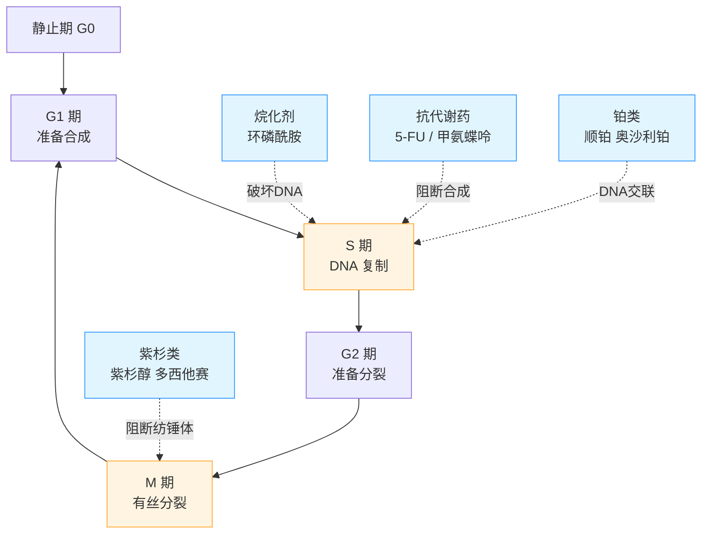
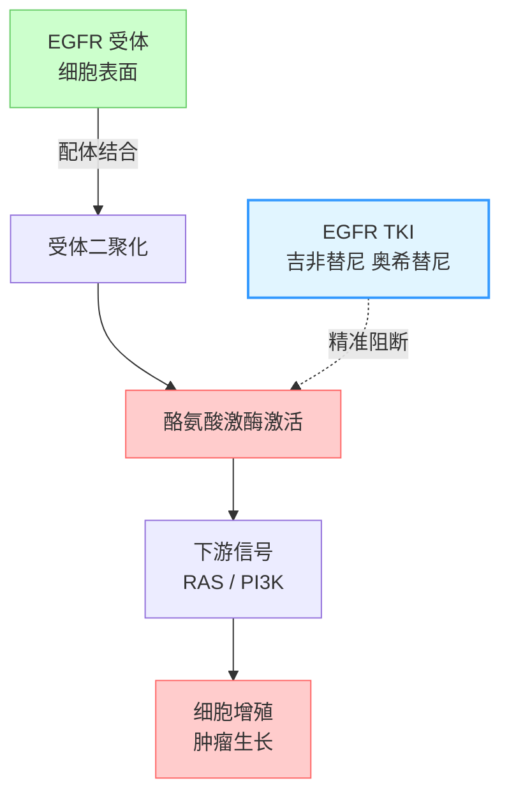
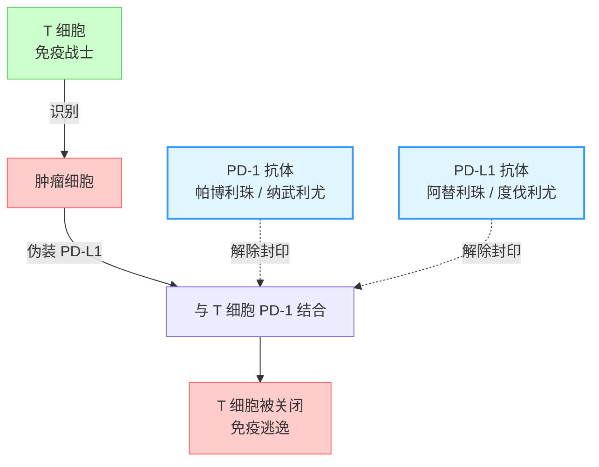
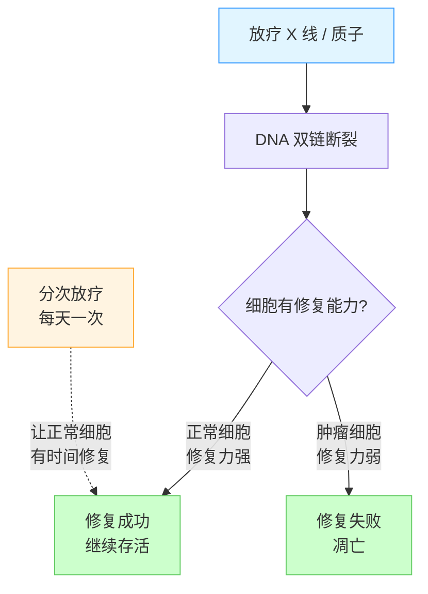
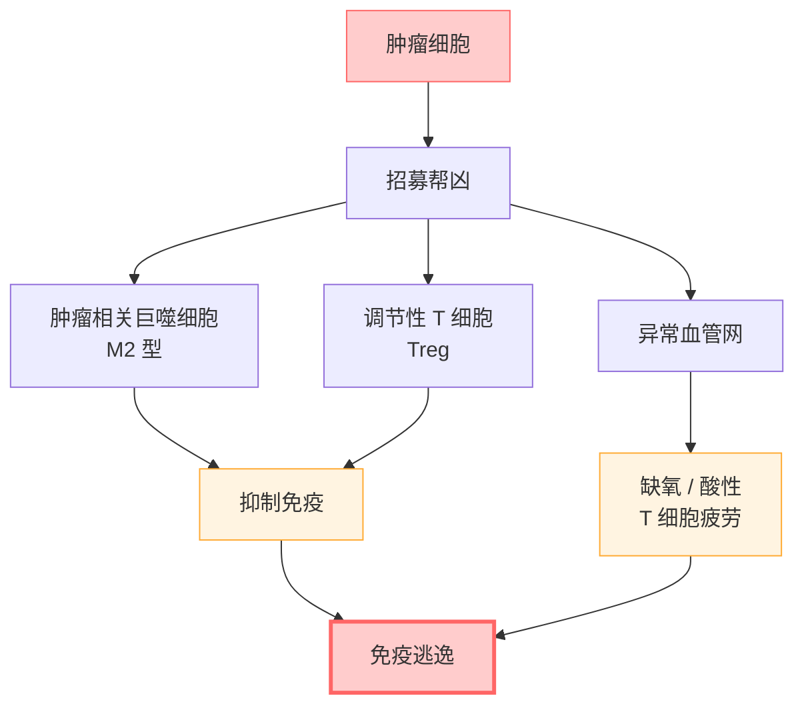

# 疾病机制图库（Mermaid）

Mechanism diagrams for common cancer treatment modalities. Each block is a
simple flowchart (≤ 10 nodes) followed by a plain-language explanation
the patient/family can read without medical training.

## Locale

Resolve locale per `../../cancer-buddy/references/i18n.md` (host `locale` first, otherwise
`profile.json.locale`, otherwise detection fallback + persist). The diagrams and explanations below are the **`zh` source rendering**.
When the patient's `locale` is not `zh`:

- Render the **plain-language explanations** ("怎么读这张图" / "为什么会有副作用"
  etc.) and the **descriptive node labels** (静止期 G0 → resting phase G0,
  准备合成 → preparing synthesis, 免疫战士 → immune soldier) in that locale.
- Keep **clinical entities inside nodes verbatim** in every locale: drug names
  (环磷酰胺, 5-FU, 甲氨蝶呤, 紫杉醇, 顺铂, 吉非替尼, 奥希替尼, 帕博利珠,
  纳武利尤, 阿替利珠, 度伐利尤, 贝伐珠单抗, 仑伐替尼 — as the source used them),
  pathway/receptor/gene symbols (EGFR, ALK, ROS1, KRAS G12C, PD-1, PD-L1, RAS,
  PI3K, Treg), cell-cycle phase codes (G0/G1/S/G2/M).
- The Styling convention colour keys and the §选图速查 selection table are
  scaffold — localize the prose/header cells, keep modality terms (TKI, PD-1/PD-L1)
  verbatim, keep the `§N` section keys stable.

The section headings ("怎么读这张图" / "为什么..." / "特别注意" / "前提条件" etc.)
are localized prose, not fixed keys — render their meaning in `locale`.

Styling convention (from vmtb-patient-education mermaid-guide):

- Info: `fill:#e1f5ff,stroke:#3399ff`
- Warning: `fill:#fff4e1,stroke:#ffaa33`
- Danger: `fill:#ffcccc,stroke:#ff6666`
- Success: `fill:#ccffcc,stroke:#66cc66`

Pick the section(s) that match the patient's `summary.current_regimen` field from
`profile.json`. If multiple apply (e.g. chemo + immuno combo), include both.

---

## 1. 癌症细胞周期与化疗作用点

**怎么读这张图**：癌细胞之所以可怕，是因为它会不停地分裂。分裂过程分成几个
阶段（G1 → S → G2 → M），每一步都要做"准备工作"，比如复制 DNA、搭建分裂机
器。化疗药物不是一把万能钥匙，而是专门在某一个环节"卡脖子"：有的专门破坏 DNA
（铂类、烷化剂），有的让原料合成不出来（5-FU、甲氨蝶呤），有的让细胞分裂时
"骨架"搭不起来（紫杉类）。

**为什么会有副作用**：化疗药认不出"好细胞"和"坏细胞"，只认"分裂快的细胞"。
骨髓造血细胞、口腔黏膜、毛囊、胃肠黏膜都分裂很快，所以容易出现白细胞下降、
口腔溃疡、掉发、恶心腹泻。这不是药"有毒"，而是药的工作原理就是这样。

---

## 2. 靶向治疗机制（EGFR TKI 举例）

**怎么读这张图**：正常细胞表面有一种"信号开关"叫 EGFR（表皮生长因子受体）。
平时它要等到真正的"生长信号"才会打开，发指令让细胞分裂。但如果 EGFR 基因发
生突变，这个开关就卡在"一直打开"的状态，肿瘤就源源不断地收到"继续长"的指令。

**靶向药怎么工作**：EGFR TKI（酪氨酸激酶抑制剂，如吉非替尼、厄洛替尼、奥希
替尼）就像一把专门配给这个开关的钥匙，把卡住的开关按下去。因为它只针对"开关
卡住"的突变细胞，对正常细胞影响小，所以副作用一般比化疗轻，但也有自己特点
（皮疹、腹泻、甲沟炎等）。

**前提条件**：必须先做基因检测，确认有 EGFR 突变（或对应的其他靶点如 ALK、
ROS1、KRAS G12C 等），靶向药才有用。没有突变还用，等于把钥匙插进没有锁的门。

---

## 3. 免疫检查点抑制剂机制

**怎么读这张图**：免疫系统的 T 细胞本来是"肿瘤杀手"，能识别出异常细胞并消灭
它。但狡猾的肿瘤会表达 PD-L1，伸出一只手去握住 T 细胞上的 PD-1 开关，相当于
对免疫细胞说"别打我，我是自己人"。T 细胞被骗了，就放下武器走开——这叫"免疫
逃逸"。

**免疫药怎么工作**：PD-1/PD-L1 抗体就像挡在两只手中间的"拆封器"，让肿瘤无
法继续伪装。T 细胞重新认出肿瘤是敌人，开始攻击。

**特别注意**：免疫治疗的副作用和化疗完全不一样。它是通过"激活免疫系统"起作
用，所以有时候免疫系统被激活过头，会攻击正常器官——皮肤（皮炎）、甲状腺
（甲状腺炎）、肺（免疫性肺炎）、肠道（免疫性肠炎）、心脏、肝脏都可能被波及。
一旦出现发热、呼吸困难、持续腹泻、明显乏力，要第一时间告诉医生，不能自行扛。

---

## 4. 辐射损伤修复

**怎么读这张图**：放疗用高能射线（X 线、质子、电子线）打肿瘤，本质是把肿瘤
细胞的 DNA 打断。问题是，射线路径上正常细胞也会被打到——那为什么正常人能扛
住、肿瘤却扛不住？

**关键机制是"修复速度差"**：正常细胞的 DNA 修复酶功能完整，被打断后几小时
就能缝好；肿瘤细胞因为基因不稳定，修复机器是残次品，缝不上就只能凋亡。

**为什么要分次**：放疗不是一次打完，而是每天一次、连续几周。每次剂量小，让
正常细胞下班后有时间修复，而肿瘤细胞来不及修复就累积损伤。这就是"分次放疗"
的生物学逻辑——不是医院故意拖时间。

**常见副作用与放射野相关**：头颈部放疗会口干、吞咽痛；胸部放疗会放射性肺炎、
食管炎；盆腔放疗会膀胱炎、肠炎；皮肤反应是共通的。

---

## 5. 肿瘤微环境与免疫逃逸

**怎么读这张图**：肿瘤不是一颗孤单的坏细胞，它会"招兵买马"改造周围的环境——
这个被改造过的"生态圈"叫肿瘤微环境（Tumor Microenvironment, TME）。

**肿瘤的帮凶**：
- **M2 型巨噬细胞**：本来应该吃掉垃圾，被肿瘤策反后反过来分泌因子保护肿瘤；
- **调节性 T 细胞（Treg）**：本来是"免疫刹车"，肿瘤把它们拉来，按住其他 T 细
  胞不让攻击；
- **异常血管网**：肿瘤长得快需要氧气，逼着新血管乱长，但这些血管是"豆腐渣
  工程"——漏、乱、不通畅，造成局部缺氧、酸性环境，T 细胞进去就"窒息"了。

**为什么重要**：现代治疗越来越不是"单打肿瘤"，而是"改造微环境"——抗血管生
成药（贝伐珠单抗、仑伐替尼）让血管正常化；免疫联合治疗同时解除多个抑制通路；
放疗既杀肿瘤也会"唤醒"免疫（远端效应）。理解微环境，能帮你理解为什么医生要
用联合方案而不是单药。

---

## 选图速查

| 患者主治疗 | 必选 | 建议 |
|---|---|---|
| 化疗（细胞毒药物） | §1 | §5 |
| 靶向（TKI 类） | §2 | §5 |
| 免疫（PD-1/PD-L1） | §3, §5 | §1（若有化疗联合） |
| 放疗 | §4 | §5 |
| 放化疗同步 | §1, §4 | §5 |
| 免疫 + 化疗 / 靶向联合 | §1/§2, §3, §5 | 全部 |
